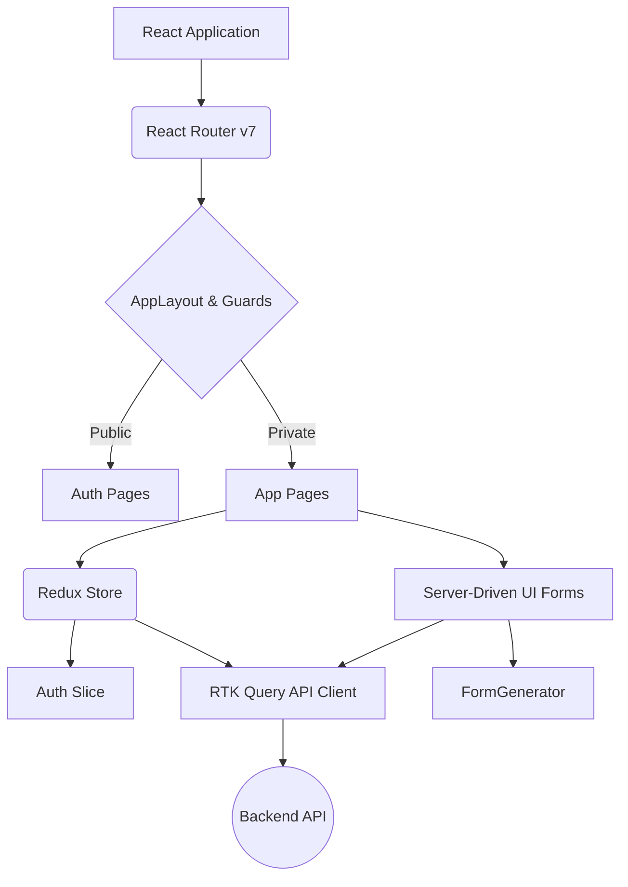

# Frontend Architecture

MesaFácil UI employs a robust architecture prioritizing scalability, type safety, and dynamic content delivery.

## High-Level Architecture Diagram

## Core Architectural Pillars

### 1. State Management (Redux Toolkit & RTK Query)
The application state is divided into two primary areas:
*   **Local UI / Client State:** Managed using standard React Context or Redux Slices (e.g., `authSlice.ts` for authentication and user permissions).
*   **Server State:** Managed exclusively through **RTK Query** via the generated API client (`mesafacilApi`). This eliminates the need for manual thunks, loaders, and caching logic.

### 2. Server-Driven UI (SDUI)
To decouple the frontend from frequent form layout or validation updates, the application implements Server-Driven UI.
*   The backend dictates the fields, validations, and order.
*   `FormGenerator.tsx` receives this schema and dynamically maps API definitions to React components using Formik and Yup.

### 3. Route & Access Management
Routing is centralized in `AppRouter.tsx`.
*   Routes are strictly protected by `PrivateRoute`, `RequireAccess`, and `PermissionGuard`.
*   The UI adapts to the user's roles and permissions, restricting unauthorized access at both the route level and the visual level (e.g., hiding sidebar items).

### 4. Styling Architecture
*   **No Tailwind/CSS-in-JS:** The project uses Vanilla CSS to maintain simplicity and performance.
*   **Design Tokens:** A central `tokens.css` file defines global CSS variables for colors, typography, spacing, and shadows.
*   **Colocation:** CSS files are colocated with their respective components (e.g., `App.css`, `index.css`, component-specific styles).
